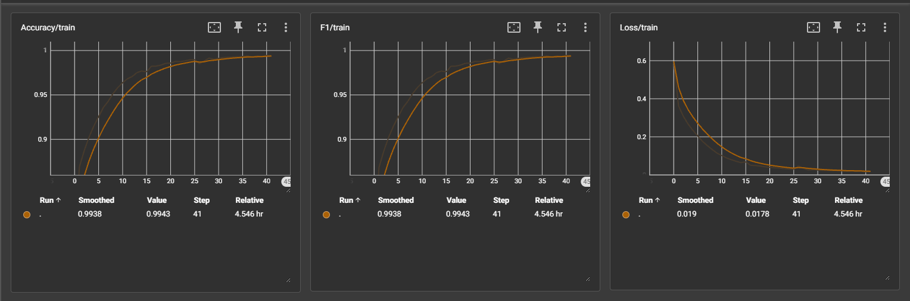

# DINOv2_Downstream

<a target="_blank" href="https://cookiecutter-data-science.drivendata.org/">
    
</a>

The goal of the project is to finetune the DINOv2 backbone which is originally pretrained by Meta using the SSL technique for downstream tasks.

## TODO
- [x] Add the DINOv2 downstream for the classification task
- [x] Adding HYO Optimization
- [ ] Add the Object Segmentation task
- [ ] Pretrain the Dinov2 backbone on the custom unlabeled dataset
## Project Organization

```
├── LICENSE            <- Open-source license, if applicable.
├── README.md          <- Top-level README for developers using this project.
├── dataset            <- Directory containing datasets for all experiments.
├── environment.yaml   <- Requirements file for reproducing the analysis environment.
│
└── src                <- Source code for this project.
    │
    ├── data        
    │   ├── data_loading.py          <- Code for data loading, including initializing the iterable for data fetching.
    ├── HYO        
    │   ├── Hyperparameter_optimization.py   <- Code for hyperparameter optimization using the Optuna toolkit.
    │
    ├── utils                
    │   ├── Utils.py          <- Utility functions, such as early stopping.
    │
    ├── models                
    │   ├── classifier.py          <- Code for adding a custom classifier to the DINOv2 model.
    │   └── train_validation_test.py <- Code for model training, validation, and evaluation.
    ├── main     
    │   ├── __init__.py      <- Makes dinov2_downstream a Python module.    
    │   ├── main.py          <- Initializes the model, loads data, trains the model, and evaluates performance.
    │   └── model_logs       <- Directory containing model logs, including saved checkpoints.

```
## Usage

To use the DINOv2 Image Classifier, follow these steps:

1. **Clone the repository:**

    ```python
    git clone https://github.com/Badar-e-Alam/DINOv2_Downstream.git
    cd DINOv2_Downstream
    ```

2. **Create the conda environment using the environment.yaml file:**

    ```python
    conda env create -f environment.yaml
    conda activate dinov2_env
    ```

3. **Run the main script for model classification:**

    ```python
    python src/main/main.py
    ```
### Classification Results




